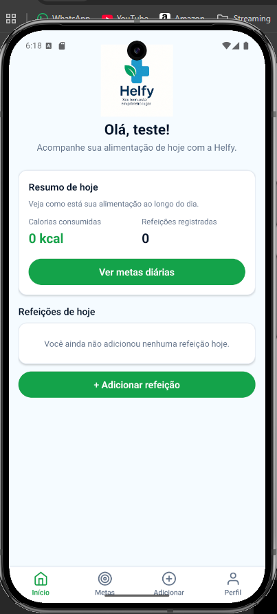
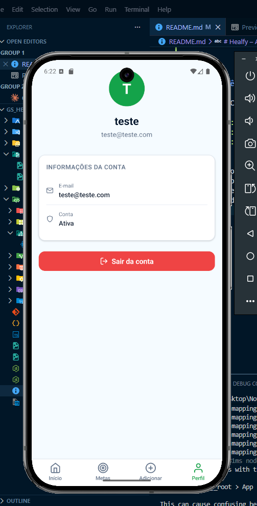
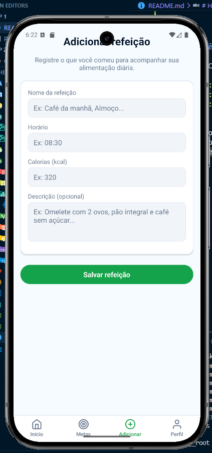
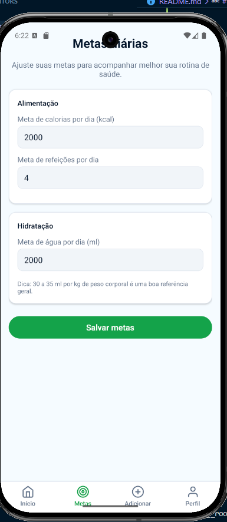

# Healfy – Acompanhamento de Alimentação e Saúde

Aplicativo mobile para organizar a alimentação e hábitos do dia a dia, permitindo registrar refeições, acompanhar calorias e definir metas diárias de saúde.

---

## Tecnologias utilizadas

- **React Native** 0.81.5
- **Expo** 54 (SDK)
- **TypeScript** 5.9 (strict mode)
- **React Navigation** 7 – Stack + Bottom Tabs
- **AsyncStorage** – persistência local
- **Context API** – gerenciamento de estado de autenticação
- **Expo Vector Icons** (Feather)

---

## Funcionalidades

| Funcionalidade | Descrição |
|---|---|
| Login com sessão | Autenticação persistida via AsyncStorage |
| Auto-login | Sessão salva: ao reabrir o app, usuário já entra logado |
| Registrar refeições | Nome, horário, calorias e descrição |
| Listar refeições | FlatList com cards das refeições do dia |
| Metas diárias | Definir meta de calorias, refeições e água |
| Persistência | Refeições e metas sobrevivem ao fechamento do app |
| Logout | Botão "Sair" na tela inicial encerra a sessão |

---

## Estrutura de pastas

```
src/
├── app/
│   └── App.tsx              # Raiz da aplicação, AuthProvider + navegação condicional
├── components/
│   └── MealCard.tsx         # Card reutilizável de refeição
├── contexts/
│   └── AuthContext.tsx      # Context API de autenticação
├── navigation/
│   ├── HomeStack.tsx        # Stack: Home → MetasDiarias / AdicionarRefeicao
│   ├── TabNavigation.tsx    # Tab: Início / Metas / Adicionar
│   └── index.tsx
├── screens/
│   ├── Login.tsx
│   ├── Home.tsx
│   ├── MetasDiarias.tsx
│   └── AdicionarRefeicao.tsx
├── services/
│   └── storageService.ts    # Funções de leitura/escrita no AsyncStorage
├── styles/
│   └── StyleSheet.ts        # Cores, espaçamentos e estilos globais
└── types/
    └── index.ts             # Interfaces, enums e tipos de navegação
```

---

## Como executar

### Pré-requisitos

- Node.js 18+
- Expo CLI: `npm install -g expo-cli`
- Emulador Android/iOS ou app **Expo Go** no celular

### Passos

```bash
# 1. Clone o repositório
git clone <url-do-repositorio>
cd GS_Healfy

# 2. Instale as dependências
npm install

# 3. Inicie o projeto
npx expo start
# ou
npm run android
```

---

## Credenciais de acesso

```
Email:  teste@teste.com
Senha:  123
```

---

## Fluxo da aplicação

```
Abertura do app
    └── Tem sessão salva? ──→ SIM ──→ Tela Home (Tab)
                          └── NÃO ──→ Tela de Login
                                           └── Login correto ──→ Salva sessão ──→ Tela Home
```

---

## Persistência local (AsyncStorage)

| Chave | Conteúdo |
|---|---|
| `@healfy:session` | Dados do usuário logado |
| `@healfy:meals` | Lista de refeições registradas |
| `@healfy:goals` | Metas diárias (calorias, água, refeições) |





